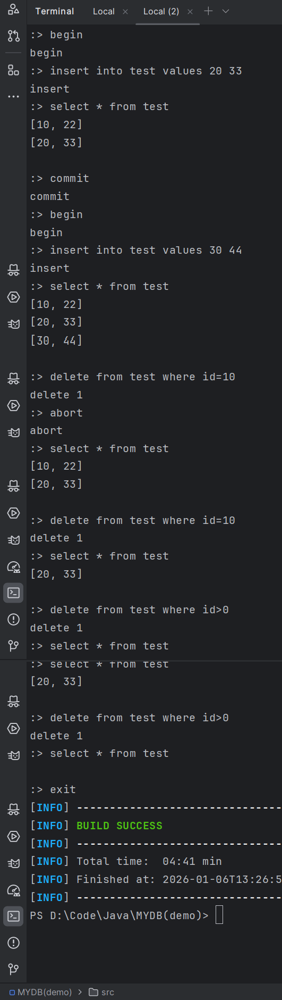

# MYDB 数据库运行指南（Windows + IDEA）

## 快速启动步骤

### 步骤 1：编译项目

在项目根目录下执行：

```
mvn clean compile
```

### 步骤 2：创建数据库

```
mvn exec:java "-Dexec.mainClass=top.dhc.mydb.backend.Launcher" "-Dexec.args=-create D:\Code\Java\MYDB(demo)\mydb"
```

**说明**：此命令会在指定路径创建数据库文件，只需执行一次。

### 步骤 3：启动数据库服务器（终端 1）

```
mvn exec:java "-Dexec.mainClass=top.dhc.mydb.backend.Launcher" "-Dexec.args=-open D:\Code\Java\MYDB(demo)\mydb"
```

**说明**：

- 服务器将在 9999 端口启动
- 看到 `Server listen to port: 9999` 表示启动成功
- **保持此终端运行，不要关闭**

### 步骤 4：启动客户端（终端 2）

打开新的 PowerShell 终端，执行：

```
cd D:\Code\Java\MYDB(demo)
mvn exec:java "-Dexec.mainClass=top.dhc.mydb.client.Launcher"
```

**说明**：

- 成功连接后会显示 `:>` 提示符
- 现在可以输入 SQL 命令进行操作

------

## SQL 命令示例

连接成功后，可以执行以下命令：

```
-- 1. 在事务中创建表和初始化数据
begin
create table test id int32, value int32 (index id)
insert into test values 10 22
insert into test values 20 33
select * from test
commit

-- 2. 测试事务提交
begin
insert into test values 30 44
commit
select * from test

-- 3. 测试事务回滚
begin
delete from test where id=10
abort
select * from test

-- 4. 直接执行删除(无事务)
delete from test where id=10
select * from test

-- 5. 退出客户端
exit
```

------

## 运行效果展示

以下是数据库运行测试的实际效果：




